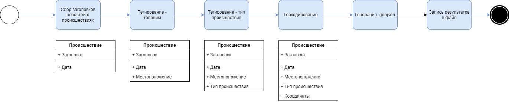

# *Автоматизация в географических исследованиях*

Материалы для мастер-класса "Автоматизация сбора открытых данных в географических исследованиях, на примере сбора и подготовки к работе в ГИС оперативных сводок МВД" на Географическом Факультете в Тверском Государственном Университете.


## Программа мастер-класса

1. Базовое знакомство с языком программирования Python

1. Установка и настройка среды разработки

1. Базовые методы автоматизации сбора данных с веб-сайта

1. Базовые методы автоматизация тегирования данных с использованием методов обработки естественного языка

1. Геокодирование и подготовка данных для использования в ГИС

## Для работы понадобится

- [Git](https://git-scm.com/)
- [PyCharm](https://www.jetbrains.com/pycharm/)
- [QGIS](https://qgis.org/ru/site/) 
- [Python 3.10](https://www.python.org/)
    - [Requests](https://docs.python-requests.org/en/latest/)
    - [Beautiful Soup](https://beautiful-soup-4.readthedocs.io/en/latest/)
    - [Natasha](https://github.com/natasha/natasha)
    - [Geocoder](https://geocoder.readthedocs.io/)
    - [Geojson](https://python-geojson.readthedocs.io/en/latest/)


## Требования к реализации средства автоматизации

Требуется реализовать сценарии Python, которые обеспечат:

1. Автоматизированный сбор сводок происшествий с веб-сайта [Управления МВД России по Тверской области](https://69.xn--b1aew.xn--p1ai/news/rubric/287/)
1. Автоматизированное извлечение информации о месте происшествия и его типе.
1. Автоматизированное создание файла формата .geojson с местоположениями происшествий и информацией о них.

Требуемый формат результирующи данных:

```JSON
[{
    "type": "Feature",
    "geometry": {
        "type": "Point",
        "coordinates": ["incidentLocationLongitude", "incidentLocationLatitude"]
    },
    "properties": {
        "incidentDate": "dd/mm/yyyy",
        "incidentNewsHeadline": "TEXT",
        "incidentNewsContent": "TEXT", 
        "incidentType": "TEXT",
        "incidentLocation": "TEXT",
    }
}]
```
## Бизнес логика


